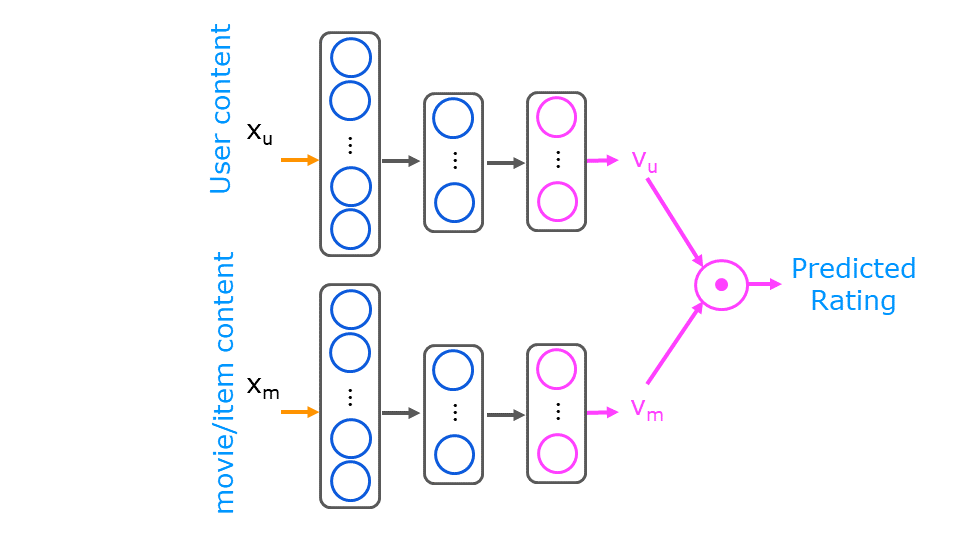

### 2.1 Content-based filtering with a neural network

In the collaborative filtering lab, you generated two vectors, a user vector and an item/movie vector whose dot product would predict a rating. The vectors were derived solely from the ratings.   

Content-based filtering also generates a user and movie feature vector but recognizes there may be other information available about the user and/or movie that may improve the prediction. The additional information is provided to a neural network which then generates the user and movie vector as shown below.
<figure>
    
 

</figure>
The movie content provided to the network is a combination of the original data and some 'engineered features'. Recall the feature engineering discussion and lab from Course 1, Week 2, lab 4. The original features are the year the movie was released and the movie's genre presented as a one-hot vector. There are 14 genres. The engineered feature is an average rating derived from the user ratings. Movies with multiple genre have a training vector per genre. 

The user content is composed of only engineered features. A per genre average rating is computed per user. Additionally, a user id, rating count and rating average are available, but are not included in the training or prediction content. They are useful in interpreting data.

The training set consists of all the ratings made by the users in the data set. The user and movie/item vectors are presented to the above network together as a training set. The user vector is the same for all the movies rated by the user. 
